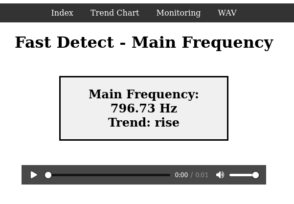
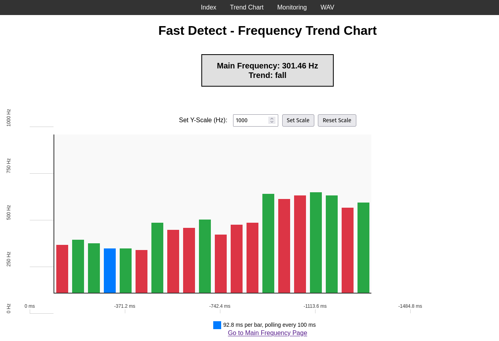
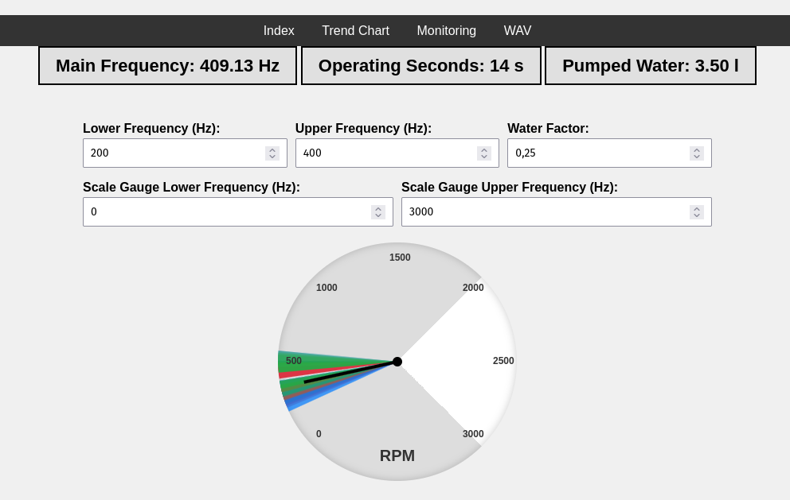

# ESP32-SpectrumAnalyzer

Using the analog input on a ESP32 to figure out whats going on in the surrounding

Steps are:
* Establish wifi connection
* Run Webserver
* Continuos high-speed data aquisition of ADC
* Data smoothing, Noramlisation and Fast Fourier Transformation
* Send frequency data over WebSocket for visualisation

Signal spec:
|capture speed [sps]|buffer size [bit]|resolution [bit]|
|--------|--------|--------|
|441000|1024|12|  

## Interfaces

  

  

  

## Audio record

This records a small wave sample and plays it back

Playback in the browser:
* Audio WAV file
*  
## FFT Analyzation

Do some analysis of the sample
Frequnecy range: 1 Hz .. 44.1 kHz

### Get main frequency

- Detect the frequency with the highest amplitude in the sample
- Output the frequency in Hz

### Detect change in Frequency
short period analysis

### Transmit over WebSocket

Update the webpage with the Data feed from the FFT Analysis

- save the frequency of each of the last samples
- tendency of speeding up/ down
